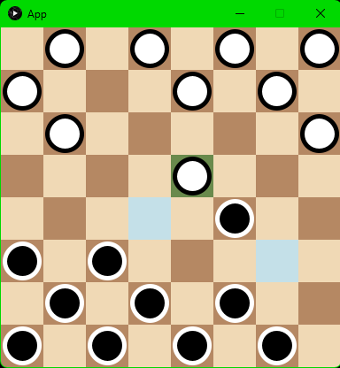

# Checkers

**INFO1113 - Object-Oriented Programming**  
The University of Sydney  
31 March 2024

<mark>**Academic Integrity:** The use of AI tools is not permitted for this assignment.</mark>

A classic Checkers (Draughts) game with smooth animation built with Java and Processing.



## Table of Contents

- [Features](#features)
- [Requirements](#requirements)
- [Building](#building)
- [Running](#running)
- [How to Play](#how-to-play)
- [Controls](#controls)
- [Project Structure](#project-structure)
- [Testing](#testing)

## Features

- 8x8 game board with standard checkers rules
- Two-player gameplay (white and black pieces)
- Piece movement with visual highlighting of valid moves
- Capturing opponent pieces by jumping
- King promotion when pieces reach the opposite end
- Animated piece movement
- Win detection

## Requirements

- Java 8 or higher
- Gradle 5.6.3+

## Building

```bash
./gradlew build
```

## Running

```bash
./gradlew run
```

Or run the JAR directly:

```bash
java -jar build/libs/I21-1.0.jar
```

## How to Play

1. White moves first
2. Click on a piece to select it (highlighted in green)
3. Valid moves are shown in blue
4. Click on a valid move to move the piece
5. Capture opponent pieces by jumping over them
6. Reach the opposite end to promote a piece to a King
7. The game ends when one player has no pieces remaining

## Controls

- **Mouse Click**: Select piece / Move piece

## Project Structure

```
├── images/
│   └── Gameplay.png        # Documentation image
├── src/
│   ├── main/java/Checkers/
│   │   └── App.java        # Main game class
│   └── test/java/Checkers/
│       └── SampleTest.java # Unit tests
├── build.gradle            # Build configuration
└── README.md
```

## Testing

```bash
./gradlew test
```
